# Genorai Cortex: Project Overview & Architecture

## 1. Project Overview
**Genorai Cortex** (RAG v2) is an autonomous, **Agentic Code Engine** designed for high-precision data analysis. Unlike traditional chatbots that "guess" answers based on text similarity, Genorai Cortex **writes and executes actual Python code** to derive mathematically accurate results from your data.

It transforms natural language queries (e.g., *"Predict next month's sales"*) into executable logic (Python/Pandas/Scikit-Learn), executes it in a secure sandbox, and returns the result.

---

## 2. System Architecture

The system follows a **Brain-Body** architecture where the LLM acts as the reasoning engine and the local Python environment acts as the execution body.

```mermaid
graph TD
    User[User Query] -->|Input| GUI[Interactive CLI]
    GUI -->|Pass Data| Cortex[🧠 CortexAgent]
    
    subgraph "Genorai Cortex Engine"
        Cortex -->|1. Inspect Schema| Context[AgentContext]
        Cortex -->|2. Generate Code| LLM[DeepSeek LLM]
        LLM -->|3. Python Script| Cortex
        
        Cortex -->|4. Execute| Executor[⚙️ CodeExecutor]
        
        subgraph "Sandboxed Execution"
            Executor -->|Run| Pandas[Pandas / Scikit-Learn]
            Pandas -->|Read| Data[(Dataset.csv/xls)]
            Pandas -->|Return| Result{Execution Result}
        end
        
        Result -->|Success| Cortex
        Result -->|Error| Retry[Error Loop]
        Retry -->|Fix Prompt| LLM
    end
    
    Cortex -->|5. Synthesize| Final[Natural Language Answer]
    Final -->|Display| User
```

### Components:
1.  **CortexAgent (The Brain)**: `agents/cortex_agent.py`
    *   **Role**: Orchestrates the entire process. It constructs a prompt containing the data schema and user query, sends it to the LLM, and handles the "Think -> Code -> Execute -> Fix" loop.
    *   **Key Logic**: Self-Correction. If the generated code fails (e.g., `SyntaxError`), it feeds the error back to the LLM to generate a fix automatically.

2.  **CodeExecutor (The Body)**: `core/execution_engine.py`
    *   **Role**: A safe, persistent Python REPL (Read-Eval-Print Loop).
    *   **Features**:
        *   **Stateful**: Remembers variables from previous queries (e.g., `model = LinearRegression()` created in step 1 is available in step 2).
        *   **Sandboxed**: Blocks dangerous commands (`os.system`, `subprocess`) to prevent system damage.
        *   **Clean**: Suppresses noisy warnings (`SettingWithCopyWarning`) for professional output.

3.  **DeepSeek LLM (The Intelligence)**:
    *   **Role**: The raw intelligence model (served via Ollama) that translates English -> Python.

---

## 3. Key Algorithms & Techniques

### A. Dynamic Code Generation (The Core Algorithm)
Instead of searching for similar text (Vector Search), we use **Program Synthesis**.
*   **Why?** Data analysis requires *calculation*, not just retrieval. "What is the sum?" cannot be answered by reading text; it requires `sum()`.
*   **How?** We prompt the LLM with the dataframe's **Schema** (Column names and Types). The LLM uses its training on millions of GitHub repositories to infer the correct Pandas operations to solve the query.

### B. Self-Reflection & Error Recovery
We implement a **ReAct-style** (Reason-Act) retry loop:
1.  **Generate**: LLM writes Code.
2.  **Execute**: Run code. Catch Exception `e`.
3.  **Evaluate**: If `e` exists -> Create new prompt: *"You wrote this code, it failed with error `e`. Fix it."*
4.  **Repeat**: Up to 3 times.
*   **Benefit**: This makes the system extremely robust against minor syntax errors or hallucinated variable names.

### C. Semantic Schema Mapping
*   **Technique**: We verify column existence before execution (in the prompt instructions) and encourage case-insensitive matching (`str.lower()`) to handle messy real-world data labels (e.g., "Toll Name" vs "toll_name").

---

## 4. Comparison: Genorai Cortex vs. Traditional RAG

| Feature | Traditional RAG (Vector DB) | Genorai Cortex (Code Engine) |
| :--- | :--- | :--- |
| **Core Mechanism** | **Retrieval**: Finds relevant text chunks based on semantic similarity. | **Execution**: Generates and runs logic/code on the data. |
| **Best For** | Unstructured Text (PDFs, Docs, Wikipedia). | Structured Data (SQL, CSV, Excel, Logs). |
| **Accuracy** | **Low for Math**: Hallucinates numbers frequently. | **100% Mathematical Precision**: It calculates, it doesn't guess. |
| **Flexibility** | **Static**: Can only answer "What does the doc say?". | **Dynamic**: Can answer "What if?", "Predict future", "Group by X". |
| **Handling New Data** | Slow: Requires re-indexing/embedding vectors. | **Instant**: Just load the file; the LLM reads the schema in real-time. |
| **Prediction** | Impossible: Cannot run ML models. | **Supported**: Can import `sklearn` and train models on the fly. |

### Summary
*   **Traditional RAG** is like a **Librarian**: Great at finding a book on a shelf.
*   **Genorai Cortex** is like a **Data Scientist**: Great at analyzing the numbers in the book to predict the future.

For your use case (Industrial logs, Sales data, Financial analysis), **Genorai Cortex** is vastly superior because it provides *computational truth*.
